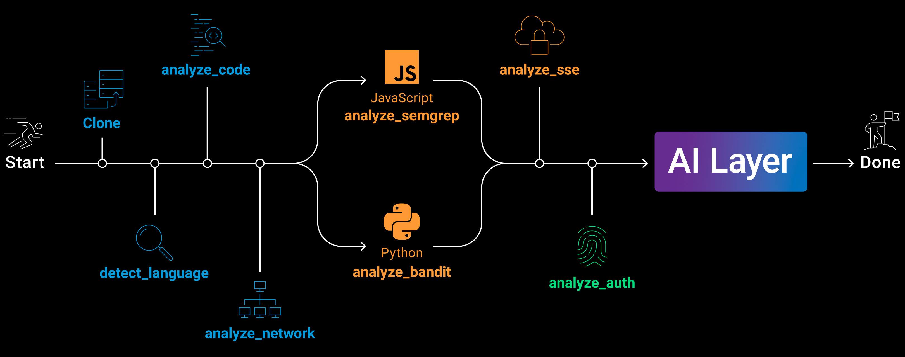

# MCProbe
MCProbe - MCP vulnerability scanning framework 


MCProbe uses LanGraph as an orchestrator for multiptle built-in modules including AI layer that tries to validate for false postivies as well as try to find leads by itself.

This framework is a POC and is desinged to be extended by the cummunity.


# Architcture



# Installation

To install all requirments us the command:

``` pip install -r requirments.txt```

# Usage

```
usage: mcprobe [-h] [--batch FILE] [--no-cfg] [--no-network] [--no-static] [--no-sse] [--no-auth] [--no-ai] [--ai-only]
               [--backend {claude,openai,claude-agent}] [--model NAME] [--env-file PATH] [--offline] [--use-os-env] [--calc-cost] [--no-validate]
               [--cost-threshold $] [--output DIR] [--depth N] [--skip-analyzed] [--threads N] [--timeout SEC]
               [repo_url]

MCProbe — MCP server vulnerability scanner

positional arguments:
  repo_url              GitHub URL or local path to analyze

options:
  -h, --help            show this help message and exit
  --batch FILE          Text file with one GitHub repo URL per line

modules (all enabled by default):
  --no-cfg              Skip MCP flow analyzer
  --no-network          Skip network analyzer
  --no-static           Skip Bandit / Semgrep
  --no-sse              Skip SSE / streaming analyzer
  --no-auth             Skip auth & authorization analyzer
  --no-ai               Skip AI security review
  --ai-only             Skip all analyzers, run only AI review on existing reports

AI backend:
  --backend {claude,openai,claude-agent}
                        AI backend (default: claude)
  --model NAME          AI model name (default: claude-sonnet-4-6 / gpt-4o-mini)
  --env-file PATH       Path to .env file (default: .env next to this script)
  --offline             Disable AI review (equivalent to --no-ai)
  --use-os-env          Also read API keys/URLs from OS environment variables (by default only .env file is used)
  --calc-cost           Dry run: scan repos with all analyzers and estimate AI cost without calling the AI API
  --no-validate         Skip AI validation of findings (validation runs by default)
  --cost-threshold $    Auto-confirm validation if cost is below threshold in USD (default: 5.0; use -1 to run without asking)

output:
  --output DIR          Base output directory (default: ./out)
  --depth N             MCP flow trace depth (default: 4)
  --skip-analyzed, --sa
                        Skip repos that already have an analysis folder
  --threads N           Number of parallel workers for batch mode (default: 1)
  --timeout SEC         Per-module timeout in seconds; each analyzer gets this limit independently (default: 300, 0=no limit)

Examples:
  # Basic scan (uses Claude AI by default)
  mcprobe_cli.py https://github.com/owner/repo

  # Offline scan — no AI review
  mcprobe_cli.py https://github.com/owner/repo --offline

  # Use OpenAI backend with a specific model
  mcprobe_cli.py <url> --backend openai --model gpt-4o

  # Use Claude with a specific model
  mcprobe_cli.py <url> --backend claude --model claude-opus-4-0-20250115

  # Skip specific modules
  mcprobe_cli.py <url> --no-static --no-sse --no-auth

  # Batch scan from a file
  mcprobe_cli.py --batch repos.txt

  # Batch scan, skip already-analyzed repos
  mcprobe_cli.py --batch repos.txt --skip-analyzed

  # Custom .env file and output directory
  mcprobe_cli.py <url> --env-file /path/to/.env --output /path/to/results

  # Allow reading API keys from OS environment variables
  mcprobe_cli.py <url> --use-os-env

  # Parallel batch scan with 10 threads
  mcprobe_cli.py --batch repos.txt --threads 10

  # Estimate AI costs without calling the API
  mcprobe_cli.py --batch repos.txt --calc-cost --model claude-opus-4-6

  # Scan without AI validation of findings
  mcprobe_cli.py <url> --no-validate

  # Re-run only AI review on already-analyzed repos
  mcprobe_cli.py --batch repos.txt --ai-only

Environment variables (read from .env file, or OS env with --use-os-env):
  ANTHROPIC_API_KEY     Anthropic API key
  ANTHROPIC_BASE_URL    Anthropic API base URL (optional)
  ANTHROPIC_MODEL       Anthropic model name (default: claude-sonnet-4-6)
  OPENAI_API_KEY        OpenAI API key
  OPENAI_BASE_URL       OpenAI API base URL (optional)
  OPENAI_MODEL          OpenAI model name (default: gpt-4o-mini)
  GH_TOKEN              GitHub token for authenticated cloning (avoids rate limits)
  GITHUB_TOKEN          Alternative to GH_TOKEN
  ```

# Open Source code attribution
The framework uses bandit and semgrep as optional modules their code can be found here:

semgrep - https://github.com/semgrep/semgrep

bandit - https://github.com/pycqa/bandit
# License
Copyright 2026 Akamai Technologies Inc. All rights reserved.

Licensed under the Apache License, Version 2.0 (the "License"); you may not use this file except in compliance with the License. You may obtain a copy of the License at

http://www.apache.org/licenses/LICENSE-2.0


** This software is not officially supported or maintained by Akamai.  It is not licensed to you under your contracts (if any) for Akamai products or services.  Rather, it is licensed under the terms of the open source license specified here. **


** Unless required by applicable law or agreed to in writing, software distributed under the License is distributed on an "AS IS" BASIS, WITHOUT WARRANTIES OR CONDITIONS OF ANY KIND, either express or implied. See the License for the specific language governing permissions and limitations under the License. terms. **